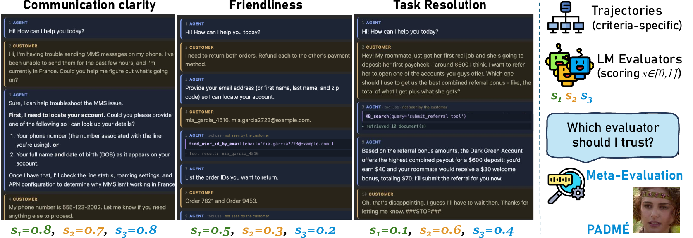
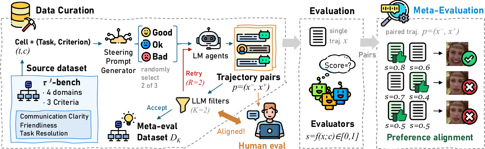

# PADMÉ — Preference Alignment Data synthesis for Meta-Evaluation

Reference implementation for the paper. Two parts:

1. **The synthesis pipeline and evaluation harness.** Generate steered trajectory pairs from
   τ³-bench tasks, filter them through a two-judge veto, and score them with a roster of
   evaluator models.
2. **The analysis.** Recompute the paper's tables from saved results.


## Paper Summary

Several evaluators score the same agent trajectory on a named criterion and disagree.
Meta-evaluation asks which of them to trust, which needs a better-trajectory label established
independently of any evaluator.



PADMÉ manufactures the label instead of annotating it: run one τ³-bench task twice with the same
agent under opposite steering on one criterion, so the better side is known by construction. Two
LM filters discard pairs whose contrast is not visible, and the surviving pairs are scored one
trajectory at a time. Pairs that fail the filtering gets retried up to a limit.



PADMÉ gnerates data with good human alignment in our experiment and is generalizable.


## Install

```bash
python -m venv .venv && . .venv/bin/activate
pip install -r requirements.txt
```

Run everything from the repo root. Do not `pip install` this package; see `pyproject.toml`.

Generation additionally needs τ³-bench, which is upstream τ²-bench at a pinned commit plus
`patches/tau3.patch`:

```bash
git clone https://github.com/sierra-research/tau2-bench.git ../tau2-bench
git -C ../tau2-bench checkout 668d3bcd135c02aa3438f987ef45735b7c163ee3
bash scripts/setup_tau3.sh
```

The evaluator sweep and the analysis do not need it.

## Analysis

Unpack the data release beside this directory as `dataset/`. These make no model
calls and need no credentials:

```bash
python tools/run_evaluators.py --dataset dataset/benchmark/eval_dataset.json \
                              --out-dir dataset/evaluations --report-only
python tools/report.py           # accuracy, ties, correlations, per-stratum slices
python tools/report_human.py     # the 150-pair human validation subset
```

`--data` defaults to `dataset/` for both report scripts.

## Generation and the sweep

```bash
python tools/run_pipeline.py --config config/smoke.yaml --dry-run   # plan only, no calls
python tools/run_pipeline.py --config config/smoke.yaml             # 3 cells
python tools/run_pipeline.py --config config/pipeline.yaml          # the published run
python tools/build_eval_dataset.py --run data/full_run
python tools/run_evaluators.py --dataset data/full_run/eval_dataset.json --runs 3 --workers 16
```

`config/pipeline.yaml` as shipped is the published configuration. `config/smoke.yaml` is one
domain, one criterion, three tasks, retries off: it exercises the harness end to end and is not
a sample of the data.

`docs/REPRODUCE.md` has the config reference, the provider lanes, and what a rerun will and will
not match.

## Layout

```
src/metaeval/
  steering/     generate the three instructions, wrap the agent, assign level contrasts
  schema/       the pair record, rendering, group -> pairs
  sources/      the τ³ boundary: domain_tasks(), task_description(), run_steered()
  judge.py      the two-judge veto cascade
  scoring.py    the score-alone protocol and score extraction
  usage.py      token and cost accounting
tools/          run_pipeline, build_eval_dataset, run_evaluators,
                report, report_human, score_one
config/         criteria.json, smoke.yaml, pipeline.yaml
patches/        tau3.patch
tests/          pytest; τ³-dependent tests skip when τ³ is absent
```

## Data release

```
dataset/
  benchmark/              the 1,000 pairs (blind), labels, judge votes, draw index
  evaluations/            25 models x 1,000 pairs x 3 runs of saved scores
  human_study/            the 150-pair subset, 6 annotators, answer key
```

`dataset/` is the default for `--data`. If it is distributed separately from this repository,
unpack it there or pass `--data <path>`. Its own `README.md` documents every file.

Human validation used an annotation interface that is not part of either release. The
judgments it collected are, with annotator identity removed; see the data release's `README.md`.

## A note on how this was written

Much of this code and its documentation was produced with AI coding agents. The pipeline has
been run end to end and the analysis scripts reproduce the numbers reported in the paper from
the released data, but rough edges and inconsistencies likely remain. Apologies for any you run
into.

## License

MIT, see `LICENSE`. τ³-bench is not vendored: it is installed from upstream with
`patches/tau3.patch` applied and remains under its own authors' license. See `NOTICE`.
